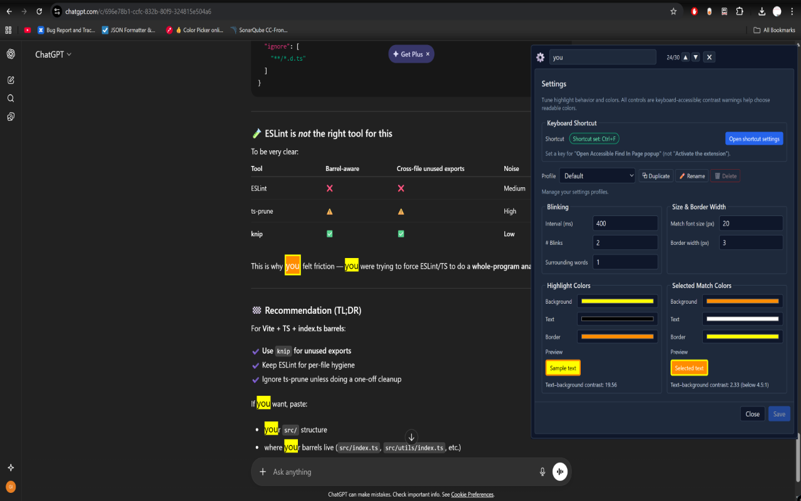

#  Accessible find in page
This project is an accessibility-focused browser extension intended to replace the default find-in-page (CTRL+F) functionality of Chromium-based browsers. I've been diagnosed with Retinitis Pigmentosa, a degenerative eye condition that severely impacts my vision. As a result, I found it challenging to use the default find-in-page feature, which often made it difficult to locate search results on a page. This extension aims to address these challenges by providing customizable highlighting options, including colors and blinking effects, to make search results more visible and easier to locate.

[Video demo](https://www.youtube.com/watch?v=aUPxAvyhch4)

## Installation
The extension has been published to the Chrome Web Store for easy installation. If you want me to release it on other browsers' extension stores, please open an issue or contact me.
### Installing from the Chrome Web Store
Go to the [Chrome Web Store listing](https://chromewebstore.google.com/detail/accessible-find-in-page/micmgbkeghgbbdmmoieoodhmofafhhlp) and click the "Add to Chrome" button.

### Installing from source
1. Clone the repository
2. Run `npm install`
3. Run `npm run build`
4. Open the extensions page in your browser
5. Enable developer mode
6. Click "Load unpacked extension"
7. Select the `root` folder of the project

After installation, an onboarding tab will open automatically with a quick guide on how to use the extension and an easy way to override the default CTRL+F shortcut. The shortcut can also be changed later in the extension settings and, if you unninstall the extension, the default CTRL+F behavior will be restored!

## Usage
The extension can be activated in any page by either:
- Clicking the extension icon in Chrome's toolbar (you can pin it for easier access)
- Pressing the shortcut (if you have set it up, otherwise it can always be changed in the onboarding tab or in the settings)
Once activated, a popup will appear where you can enter your search query. The extension will highlight all occurrences of the query on the page according to your settings.

# Contributing
Feel free to contribute! Any help is appreciated, be it code, documentation, or just ideas!
If you like the extension, please do star this repository and leave a review on the [chrome extension store](https://chromewebstore.google.com/detail/accessible-find-in-page/micmgbkeghgbbdmmoieoodhmofafhhlp).
